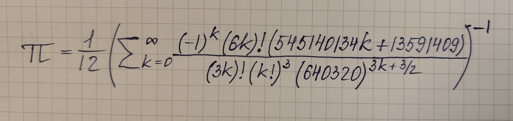
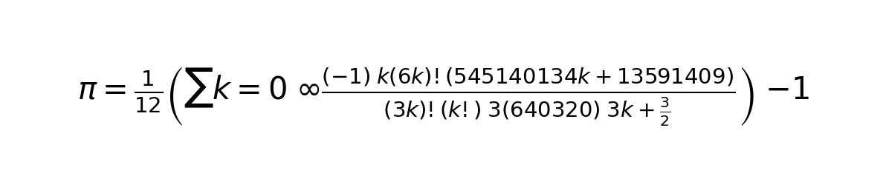

# Technical Report

## 1. Objective

The objective of this project was to fine-tune a vision-language model for handwritten formula recognition and convert input images into LaTeX. The project also required building a Streamlit application that accepts an image of a handwritten formula and displays the generated LaTeX together with the rendered mathematical expression.

## 2. Models Explored

The project explored two model families:

- `HuggingFaceTB/SmolVLM-256M-Instruct`
- `Qwen/Qwen2-VL-2B-Instruct`

All supervised fine-tuning experiments were performed with:

- LoRA adapters
- 4-bit quantization
- Hugging Face `transformers`
- `peft`

## 3. Datasets

The following datasets were used:

- `linxy/LaTeX_OCR`, subset `human_handwrite`
- `deepcopy/MathWriting-human`

The required evaluation split was:

- `linxy/LaTeX_OCR:test` with 70 examples

## 4. Experimental Setup

Hardware:

- NVIDIA RTX 5060 Ti
- 16 GB VRAM
- 128 GB RAM

Software:

- Debian
- PyTorch
- Transformers
- PEFT
- bitsandbytes
- Streamlit

Primary evaluation metric:

- `Token F1`

This metric was selected as the primary one because it captures partial correctness of generated LaTeX more reliably than exact match, while remaining directly relevant to structured formula transcription.

Additional metrics:

- BLEU
- Exact Match
- Edit Distance

## 5. Results

Final comparison across the four required setups:

| Setup | BLEU | Exact Match | Edit Distance | Token F1 |
|---|---:|---:|---:|---:|
| zero_shot | 0.5210 | 0.1429 | 0.5390 | 0.7507 |
| one_shot | 0.2082 | 0.1000 | 0.3735 | 0.4234 |
| sft_latex_ocr | 0.8989 | 0.6857 | 0.9115 | 0.9685 |
| sft_combined | 0.8492 | 0.6000 | 0.8722 | 0.9527 |

Interpretation:

- The strongest final result was obtained with supervised fine-tuning on `linxy/LaTeX_OCR` only.
- Zero-shot inference was already a strong baseline.
- One-shot prompting degraded performance under the tested prompt format.
- The combined dataset setup remained strong, but slightly underperformed the single-dataset SFT run.

## 6. Training Attempts

### Attempt A: SmolVLM initial local run

Model:

- `HuggingFaceTB/SmolVLM-256M-Instruct`

Hyperparameters:

- epochs: `3`
- train batch size: `2`
- eval batch size: `2`
- gradient accumulation steps: `8`
- learning rate: `2e-4`
- max length: `512`
- gradient checkpointing: `true`
- precision: `bf16`

Outcome:

- The model degraded after SFT.
- This configuration was too aggressive for a small multimodal model.

### Attempt B: SmolVLM conservative retry

Hyperparameters:

- epochs: `2`
- train batch size: `1`
- eval batch size: `1`
- gradient accumulation steps: `8`
- learning rate: `5e-5`
- max length: `384`
- precision: `bf16`
- secondary sample size: `3000`

Outcome:

- Performance remained poor.
- The shorter context likely worsened prompt and answer clipping.

### Attempt C: SmolVLM max-length safety retry

Hyperparameters:

- epochs: `2`
- train batch size: `1`
- eval batch size: `1`
- gradient accumulation steps: `8`
- learning rate: `2e-5`
- max length: `256`
- precision: `bf16`

Outcome:

- The sequence budget was too small for multimodal training.
- This setup was not viable for preserving the assistant target inside the loss window.

### Attempt D: SmolVLM context-safe retry

Hyperparameters:

- epochs: `2`
- train batch size: `1`
- eval batch size: `1`
- gradient accumulation steps: `4`
- learning rate: `2e-5`
- max length: `1024`
- precision: `bf16`

Outcome:

- Logs still showed that prompt and image tokens could consume the entire context window.
- Some examples contained no assistant tokens in the effective loss region.

### Attempt E: SmolVLM long-context retry

Hyperparameters:

- epochs: `2`
- train batch size: `1`
- eval batch size: `1`
- gradient accumulation steps: `2`
- learning rate: `1e-5`
- max length: `2048`
- precision: `bf16`

Observed metrics:

- Exact Match: `0.0000`
- BLEU: `0.0104`
- Edit Distance: `0.0113`
- Token F1: `0.0123`

Outcome:

- Even a larger context did not recover the model.
- The evidence suggested that `SmolVLM-256M-Instruct` was too weak or too brittle for the task under the current fine-tuning recipe.

### Attempt F: Qwen2-VL successful run

Model:

- `Qwen/Qwen2-VL-2B-Instruct`

Config:

- [train_config.qwen2vl_2b.yaml](configs/train_config.qwen2vl_2b.yaml)

Hyperparameters:

- epochs: `2`
- train batch size: `1`
- eval batch size: `1`
- gradient accumulation steps: `4`
- learning rate: `1e-5`
- weight decay: `0.01`
- warmup ratio: `0.05`
- max length: `2048`
- gradient checkpointing: `true`
- precision: `bf16`
- LoRA rank: `16`
- LoRA alpha: `32`
- LoRA dropout: `0.05`
- 4-bit quantization

Observed metrics for `sft_latex_ocr`:

- Exact Match: `0.6857`
- BLEU: `0.8989`
- Edit Distance: `0.9115`
- Token F1: `0.9685`

Observed metrics for `sft_combined`:

- Exact Match: `0.6000`
- BLEU: `0.8492`
- Edit Distance: `0.8722`
- Token F1: `0.9527`

Outcome:

- This was the first clearly successful supervised fine-tuning setup.
- `Qwen2-VL-2B-Instruct` substantially outperformed both zero-shot prompting and all SmolVLM experiments.
- The best final model was the `LaTeX_OCR`-only run.

## 7. Streamlit Demo

The repository includes a Streamlit application in [app/streamlit_app.py](app/streamlit_app.py). The demo was tested on a real handwritten formula photo using the final fine-tuned Qwen checkpoint.

Demo assets:

- input image: [streamlit_input_photo.jpg](demo/streamlit_input_photo.jpg)
- generated LaTeX file: [streamlit_prediction_text.tex](demo/streamlit_prediction_text.tex)
- rendered output image: [streamlit_rendered_output.png](demo/streamlit_rendered_output.png)
- screen recording: [streamlit_demo.mp4](demo/streamlit_demo.mp4)

Input handwritten photo:



Rendered model output:



Predicted LaTeX shown in the demo:

```tex
\pi = \frac { 1 } { 1 2 } \left( \sum _ { k = 0 } ^ { \infty } \frac { ( - 1 ) ^ { k } ( 6 k ) ! ( 5 4 5 1 4 0 1 3 4 k + 1 3 5 9 1 4 0 9 ) } { ( 3 k ) ! ( k ! ) ^ { 3 } ( 6 4 0 3 2 0 ) ^ { 3 k + \frac { 3 } { 2 } } } \right) ^ { - 1 }
```

The direct video link above can be opened from the GitHub report page.

## 8. Checkpoints

Published checkpoints:

- [qwen2vl-latex-ocr](https://huggingface.co/dmitryz1024/qwen2vl-latex-ocr)
- [qwen2vl-latex-ocr-combined](https://huggingface.co/dmitryz1024/qwen2vl-latex-ocr-combined)

## 9. Reproducibility

Best single-dataset run:

```bash
python -m src.train --config configs/train_config.qwen2vl_2b.yaml --run_name qwen2vl_latex_only
```

Combined run:

```bash
python -m src.train --config configs/train_config.qwen2vl_2b.yaml --use_secondary --run_name qwen2vl_combined
```

Final evaluation:

```bash
python -m src.evaluate --model_name "Qwen/Qwen2-VL-2B-Instruct" --checkpoint_latex_ocr ./checkpoints/qwen2vl_latex_only/final --checkpoint_combined ./checkpoints/qwen2vl_combined/final --dataset "linxy/LaTeX_OCR" --subset "human_handwrite" --eval_mode all --output evaluation_results_qwen2vl_all.json
```

Streamlit demo:

```bash
streamlit run app/streamlit_app.py
```

## 10. Conclusion

The final project successfully solves handwritten formula recognition using a vision-language model and provides a working Streamlit demonstration. The strongest result was achieved with `Qwen/Qwen2-VL-2B-Instruct` fine-tuned on `linxy/LaTeX_OCR`, reaching `Token F1 = 0.9685` on the required test split. The combined `LaTeX_OCR + MathWriting-human` setup also performed strongly, but slightly below the best single-dataset run. The earlier SmolVLM experiments were still valuable because they demonstrated that model capacity, not only hyperparameter tuning, was the main limiting factor for this task.
